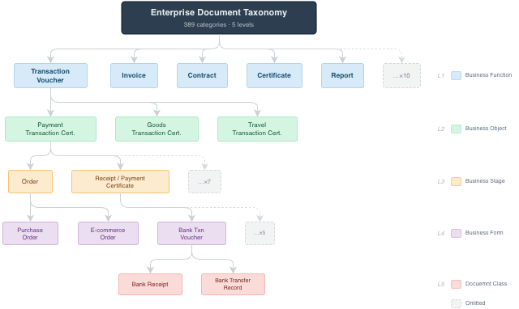
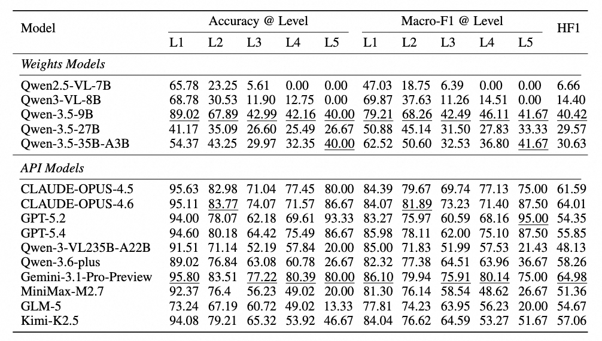

# A Multi-Scenario Multi-Modal Document Classification Benchmark with Multi-grained Hierarchical Taxonomy

<div align="center">

[]()
[](https://github.com/MMMDC-Bench/MMMDC-Bench)

</div>

<p align="center">
 <a href="#-overview"> 📖 Overview </a> •
 <a href="#document-taxonomy"> 🌲 Document Taxonomy </a> •
 <a href="#benchmark-results">📊 Benchmark Results</a> •
 <a href="#️-setup">⚙️ Setup</a> •
 <a href="#-data-preparation">📊 Data Preparation </a>
 <br>
 <a href="#-inference">🔧 Inference </a> •
 <a href="#-evaluation">📃 Evaluation </a> •
 <a href="#-citation">📝 Citation</a> •
</p>


## 📖 Overview
**MMMDC-BENCH** is a Multi-grained, Multi-Scenario Multi-Modal Document Classification benchmark designed to rigorously evaluate the Document Classification (DC) capabilities of Large Multimodal Models (LMMs) across realistic and diverse application scenarios.

## 🌲 Document Taxonomy 


## Benchmark Results


## ⚙️ Setup
**Install dependencies**
```bash
conda create -n mmmdc python=3.10.19
pip install -r requirements.txt
```

## 📊 Data Preparation
Use scripts under `scripts/data_construct/` to build hierarchical classification datasets.

### 1) DP Strategy Dataset Construction
```bash
bash scripts/data_construct/hierarchical_dp_data_construct_configurable.sh
```

Before running, update these fields in the script:
- `DATA_PATH`: set to a real table file in this repo, e.g. `./datasets/test.csv` or `./datasets/demo.csv`
- `LABEL_CONFIG_PATH`: `./datasets/document_taxonomy.json`
- `COL_MAP`: map your actual column names (e.g. `ocr_text`, `image_path`, `file_name`, `file_type`)

### 2) Retrieval-Candidates-Precomputed Dataset Construction
```bash
bash scripts/data_construct/hierarchical_retrieval_candidates_precomputed_data_construct_configurable.sh
```

Before running, update:
- `DATA_PATH`: input table with candidate label column
- `CANDIDATE_COL`: candidate label column name (default `candidate_labels`)
- `LABEL_CONFIG_PATH`: `./datasets/document_taxonomy.json`

Generated data is saved to `datasets/vlm_*` directories configured by each script.


## 🔧 Inference

This section covers hierarchical document classification inference scripts in `scripts/llm_infer/`.

### Running Inference with OpenAI API

Use:
```bash
bash scripts/llm_infer/run_hierarchical_doc_cls_infer_on_llm_api.sh
```

Before running, edit the script with valid project-local inputs:
- `INPUT`: e.g. `./datasets/demo.json` or your constructed JSON file under `datasets/vlm_*`
- `OUTPUT`: e.g. `./outputs/predict_results/<dataset>/<file>.json`
- `MODEL_NAME`, `BASE_URL`, `API_KEY`, `API_PROTOCOL`
- optional: `MAX_WORKERS`, `BATCH_SIZE`, `RESUME_FLAG`, shard config (`SHARD_ID`, `NUM_SHARDS`)

You can also run the Python entry directly:

```bash
python src/llm_infer/llm_api_hierarchical_infer.py \
  --input <input_json> \
  --output <output_json> \
  --model <model_name> \
  --base_url <base_url> \
  --api_key <api_key> \
  --api_protocol openai
```

`scripts/llm_infer/run_hierarchical_doc_cls_infer_on_llm_weights.sh` is for local-weight inference, but its default paths are environment-specific; update paths before use.

You can use vLLM to deploy local models, for example: 

```bash
CUDA_VISIBLE_DEVICES=0,1 python -m vllm.entrypoints.openai.api_server --model xxx --served-model-name xxx --dtype=auto --tensor-parallel-size2 --trust_remote_code --gpu-memory-utilization 0.8 --api-key xxx
```

## 📃 Evaluation
After running inference, evaluate the results using the evaluation script.

### Using the Evaluation Script

Use the script below for hierarchical document classification evaluation:
```bash
bash scripts/evaluate/run_hierarchical_doc_cls_eval.sh
```

Before running, edit configuration variables in `scripts/evaluate/run_hierarchical_doc_cls_eval.sh`:

- `STRATEGY`: `dp`, `dl`, `dh`, `tmh`, `dh_cot`, `few_shot`, `retrieval_candidates_precomputed`
- `PREDICT_ROOT`, `DATASET_NAME`, `PREDICT_FILE_PREFIX`: locate prediction files under `outputs/predict_results`
- `LABEL_CONFIG_PATH`: taxonomy config file from this repo, e.g. `./datasets/document_taxonomy.json`
- `OUTPUT_FIELD`, `PREDICT_FIELD`: ground-truth / prediction field names in prediction json/jsonl

The script automatically supports both single-file and sharded prediction outputs:
- `xxx.json`
- `xxx.json_0`, `xxx.json_1`, ...

You can also run evaluation directly with Python:

```bash
python src/evaluate/offline_evaluate.py \
  --task hierarchical_classify \
  --predict_dir ./outputs/predict_results/<DATASET_NAME> \
  --predict_file_prefix <PREDICT_FILE_PREFIX> \
  --save_dir ./outputs/eval_results/<EVAL_NAME> \
  --response output \
  --predict_field predict \
  --label_config_path ./datasets/document_taxonomy.json \
  --label_code_key label_code \
  --label_name_key label_name \
  --label_parent_key label_parent \
  --strategy dp \
  --path_separator " > "
```

**OPTIONS args:**
- `--task`: `offline_classify` or `hierarchical_classify`
- `--predict_dir`: prediction file or directory path
- `--predict_file_prefix`: prefix for sharded files in directory mode
- `--save_dir`: directory to save `metrics.json`, `report.txt`, and detailed results
- `--label_config_path`: label taxonomy config for hierarchical evaluation
- `--strategy`: `dp` / `dl` / `dh` / `tmh` / `dh_cot` / `few_shot` / `retrieval_candidates_precomputed`
- `--tmh_aggregate`: enable TMH chain aggregation evaluation


## Document Taxonomy Adapter
Run taxonomy adaptation with:
```bash
bash scripts/taxonomy_adapt/run_taxonomy_adapt.sh
```

Before running, update:
- `INPUT_TABLE`: e.g. `./datasets/test.csv`
- `OUTPUT_DIR`: e.g. `./outputs/taxonomy_adapt`
- `BASE_URL`, `API_KEY`, `MODEL_NAME`, `API_PROTOCOL`
- optional import/export taxonomy paths

Related config files in this repo:
- `configs/predefined_doc_type.json`
- `configs/llm_model_to_client.json`


## 📝 Citation

If you find our work to be of value and helpful to your research, please acknowledge our contributions by citing us in your publications or projects:

```bibtex
@article{mmmdc2026,
  title={A Multi-Scenario Multi-Modal Document Classification Benchmark with Multi-grained Hierarchical Taxonomy},
  author={Anoymous Author},
  journal={arXiv preprint},
  year={2026}
}
```


## 📄 License

This dataset is provided for academic research purposes only. The code in this repository is released under the MIT License. See the LICENSE file for details.
